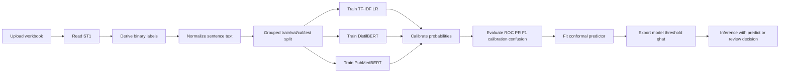

# Negative Efficacy Classification for Clinical-Trial Termination Sentences

## Executive summary

Razuvayevskaya et al. established the right starting point: treat the free-text stop reason as a learnable NLP signal, use a curated ontology, and fine-tune a BERT-class model on manually labelled sentences from ClinicalTrials.gov. In their 2024 continuation of the earlier Pak curation work, they classified 28,561 stopped trials, merged stop reasons into 17 classes, and reported that lack-of-efficacy and futility language forms a coherent semantic cluster. Their methods section also gives a concrete BERT recipe that is directly reusable for this task.

For your binary task, the cleanest implementation is **not** to reuse the public stop-reason checkpoint for headline evaluation on the supplied `ST1` sheet, because the public artefacts come from the same curation lineage and therefore risk overlap leakage. The strongest clean design is: use the user-provided `ST1` workbook as the **primary dataset**, derive a conservative binary label for “negative efficacy” versus “other”, split by **normalised sentence text** to keep repeated boilerplate together, and compare three methods: a sparse lexical baseline, a lightweight transformer, and a biomedical transformer. For deployment, I recommend a **calibrated PubMedBERT binary classifier with split conformal prediction**, while always retaining the TF–IDF logistic regression model as a must-beat baseline.

The main practical conclusion from the literature is that this is a **short-text, low-resource, high-consequence classification** problem. That combination strongly favours an evaluation stack that goes beyond raw accuracy: threshold tuning on a calibration split, reliability diagrams, Expected Calibration Error, confusion matrices, and an abstention mechanism for low-information or ambiguous sentences. Temperature scaling remains the most practical post-hoc calibrator; conformal prediction is the most principled way to turn probabilities into “predict / review” decisions; MC dropout and ensembles are best treated as optional upgrades rather than defaults because they add inference cost.

## Evidence base and data landscape

The supplied `ST1` workbook is the right primary supervision source because it is the manually curated stop-reason sheet that the Razuvayevskaya/Open Targets work explicitly revisits. That lineage labels each trial with up to three reason codes and a higher-level outcome category, which is exactly what you need to derive a binary “negative efficacy” target from the single-sentence stop-reason text. On the registry side, the `Why Study Stopped` field is a formal data element tied to withdrawn, suspended, and terminated studies, and the same field is exposed in the daily refreshed AACT mirror maintained by the Clinical Trials Transformation Initiative.

### Source priorities

| Priority | Source | Why it matters for this build |
|---|---|---|
| Highest | Razuvayevskaya et al. 2024 in *Nature Genetics* | Starting taxonomy, model family, hyperparameters, and proof that stop reasons are learnable from single-sentence text |
| Highest | User-provided `ST1` workbook | Primary supervised dataset for this binary task; should drive all clean headline evaluation |
| High | Open Targets dataset/model cards on Hugging Face | Public artefacts, class inventory, training recipe, and ready-made external baseline ideas |
| High | Open Targets stop-reasons repo on GitHub | Public training and inference scripts; useful implementation reference |
| High | ClinicalTrials.gov / AACT docs | Official semantics and scalable access path for future external data collection |
| Medium | Elkin et al. 2021 predictive termination modelling | Broad clinical-trial ML evidence that text features materially help trial-failure prediction |
| Medium | Huo et al. 2021 China discontinuation study | Independent confirmation that futility/lack of efficacy is a meaningful but minority discontinuation reason |
| Medium | Picard et al. 2025 and TrialBench 2025 | Possible augmentation sources, but weaker provenance because they rely on LLM or automated relabelling |

In this scan, I did **not** find another clearly maintained, public, sentence-level, manually curated corpus that is as directly aligned to your binary target as the Pak/Open Targets lineage. The nearest public artefacts are the Open Targets dataset and model card, which are valuable but overlap-prone for ST1-based evaluation; newer resources such as TrialBench and the Picard negative-labelling study are interesting, but they move to broader failure categories or use GPT-based labelling rather than the kind of manual sentence-level gold set you want for a benchmark.

The underlying epidemiology also supports your target choice. Pak’s earlier analysis found that only a minority of stopped trials clearly reflected a negative outcome such as failure to establish efficacy, while Williams et al. showed that many trial terminations are driven instead by accrual, logistics, or other operational reasons. Huo et al. found a similar pattern in mainland China, where commercial or strategic decisions were common and futility/lack of efficacy was still one of the major scientific reasons for discontinuation. That means the task is both **imbalanced** and **clinically meaningful**, which is exactly the regime where calibration and thresholding matter.

## Methods review

Recent text-classification surveys and biomedical NLP benchmarks support a simple but important conclusion: for **short, formulaic text**, sparse lexical baselines remain strong, while transformers win when paraphrase, semantic drift, or biomedical vocabulary matter. Domain-specific pretraining helps in biomedicine, and fine-tuning stability becomes especially important when labels are limited. PubMedBERT is one of the strongest clean biomedical starting points for this reason, while DistilBERT remains attractive when you need substantially lower compute and latency.

That trade-off maps well onto your task. The sentence field is short enough that **word and character n-grams** can capture highly predictive phrases such as “futility”, “lack of efficacy”, or “did not meet endpoint”, so a class-weighted TF–IDF logistic regression should be treated as a serious benchmark rather than a toy. But because future registry text will inevitably include paraphrases, indirect wording, and biomedical nuance, a biomedical transformer is still the better long-run deployment choice if it calibrates well on held-out data. A lightweight transformer such as DistilBERT gives you a useful middle point on the accuracy–cost frontier.

On uncertainty, the evidence is even clearer. Raw neural confidences are often miscalibrated; temperature scaling is still the cheapest and most reliable default post-hoc fix; MC dropout provides an approximate Bayesian signal but increases inference time and still does not replace calibration; and conformal prediction is currently the cleanest way to convert model scores into a prediction set or abstention policy with distribution-free guarantees under exchangeability. In clinical text settings, selective-classification approaches can materially reduce unsafe automation by routing uncertain cases for review rather than forcing a point prediction.

A useful fourth method exists but I would not put it in the first notebook: SetFit. It is fast, works well in low-data settings, and is a credible next experiment if you later want a sentence-embedding model that is cheaper than full transformer fine-tuning and more semantic than sparse TF–IDF. I would keep it behind the three methods below only because you asked for a compact, reproducible Colab benchmark and the three selected models already span the key trade-offs.

## Recommended modelling approaches

The table below is the design I recommend for the first clean benchmark and deployable implementation.

| Approach | Preprocessing and features | Split and training recipe | Confidence method | Main trade-off |
|---|---|---|---|---|
| **TF–IDF + Logistic Regression** | Lowercase and normalise whitespace; word 1–2 grams plus character 3–5 grams; no metadata beyond the sentence | Grouped train/validation/calibration/test split by normalised sentence text; class-weighted logistic regression; tune `C` around 2–8; calibration via isotonic or sigmoid on the calibration split | Raw log-odds, probability, post-hoc calibration, entropy, threshold tuned on calibration split | Cheapest, fastest, highly interpretable, often very strong on formulaic phrasing; weaker on paraphrase and future language drift |
| **DistilBERT** | Sentence tokenisation only; max length around 96 tokens is usually enough for this field | Grouped split; fine-tune 3–5 epochs; batch size around 16; learning rate around `2e-5`; early stopping on grouped validation split | Temperature-scaled probability, entropy, margin; optional MC dropout | Good middle ground on accuracy, GPU cost, and inference speed; less domain-specialised than PubMedBERT |
| **PubMedBERT** | Same as DistilBERT; sentence only; no metadata leakage | Grouped split; fine-tune 3–5 epochs; batch size around 16; learning rate around `2e-5`; weight decay around `0.01`; early stopping; if instability appears, freeze lower layers or reduce LR | Temperature scaling by default; split conformal prediction for predict/review routing; optional MC dropout | Best clean semantic starting point for biomedical text; highest compute of the three, but strongest expected robustness to wording variation |

Across all three approaches, I would standardise the data protocol. Use the supplied `ST1` sheet as the source of labels; derive the **positive class conservatively** from explicit efficacy-related reason codes such as `Insufficient Efficacy`, `Futility`, and `Unmet endpoint`; keep a second, broader “relaxed” mapping only as a sensitivity analysis; and perform all splitting with **grouped sentence-level blocking** so that duplicate or near-duplicate boilerplate reasons do not leak across train and test. That protocol is closer to real deployment and more defensible scientifically than a naive random row split.

For evaluation, I would lock in one grouped held-out test split and one grouped calibration split, then report: accuracy, precision, recall, and F1 for the negative-efficacy class; ROC-AUC; PR-AUC or average precision; Brier score; Expected Calibration Error; reliability diagram; ROC curve; PR curve; threshold-versus-precision/recall/F1 chart; and a confusion matrix. For operational use, the decision threshold should be tuned on the calibration split rather than hard-coded at 0.5, and the model should abstain when either the conformal set is non-singleton or the calibrated probability lies in a narrow uncertainty band around the threshold.

My recommendation for the **primary model** is therefore: **PubMedBERT fine-tuned on the conservative binary labels, followed by temperature scaling and split conformal prediction**. My recommendation for the **production safety net** is: keep the TF–IDF logistic model in the same notebook, compare both on the grouped test set, and only prefer the transformer if it improves semantic generalisation **without** materially worsening calibration. That is the most honest continuation of the Razuvayevskaya approach while staying clean on overlap.

## Google Colab implementation

I also created a runnable notebook:

- [clinical_trial_negative_efficacy_colab.ipynb](sandbox:/mnt/data/clinical_trial_negative_efficacy_colab.ipynb)

The notebook reads the provided workbook, loads `ST1`, builds the binary target, performs grouped splits by normalised sentence text, trains the three recommended models, calibrates probabilities, generates ROC/PR/reliability/confusion-matrix outputs, computes conformal prediction sets, optionally runs MC dropout for the best transformer, and exports the fitted artefacts to `/content/negative_efficacy_export`. It is written to run on standard Google Colab, with upload-based data loading and GPU detection built in.

### Pipeline

The notebook deliberately does **not** use the public Open Targets stop-reason checkpoint for clean headline evaluation, because the paper, dataset card, and model card together make it clear that those public artefacts sit on the same manually curated stop-reason lineage as ST1. They are excellent for external comparison later, but not for a leakage-resistant first benchmark on the supplied sheet.

## Risks and extensions

The biggest scientific risk is **label ambiguity rather than model architecture**. Some stop-reason sentences are genuinely informative, while others are placeholders such as “see detailed description” or other low-context boilerplate. The Razuvayevskaya paper itself notes that some classes are linguistically harder and that human agreement falls for the same categories where model performance weakens. For your binary task, the safest response is not to force those examples into overconfident point predictions; it is to expose uncertainty and route them to review.

The most useful next extension is **external freshness**, not a fancier model. Pull a newer unlabeled `why_stopped` sample from ClinicalTrials.gov or AACT, manually annotate a few hundred fresh sentences, and use that as a genuine temporal holdout. That is where you can fairly compare your clean binary models against the public Open Targets checkpoint, active-learning variants, or weakly supervised augmentation from newer resources. AACT’s daily refresh and exposed `why_stopped` field make that workflow straightforward.

If you later want more data now, the expansion options exist but should be ranked carefully. The strongest related public artefacts are the Open Targets dataset and codebase; the weaker but still interesting ones are TrialBench and the Picard negative-labelling study, both of which show that LLM-assisted failure labelling is feasible, but neither should outrank your manually curated ST1 labels in model selection or headline claims. Use them, if at all, as auxiliary weak supervision after deduplication and provenance tracking.

Overall, the implementation I would trust most is conservative and practical: **clean ST1-derived binary labels, grouped splits, TF–IDF logistic as must-beat baseline, PubMedBERT as primary deployment model, temperature scaling for calibration, and conformal prediction for abstention**. That extends the Razuvayevskaya methodology faithfully, avoids overlap mistakes, and produces a notebook you can run immediately in Colab.

## References

1. Razuvayevskaya O, et al. *Genetic factors associated with reasons for clinical trial stoppage*. Nature Genetics. 2024. https://www.nature.com/articles/s41588-024-01854-z
2. Open Targets. *clinical_trial_reason_to_stop* dataset card. Hugging Face. https://huggingface.co/datasets/opentargets/clinical_trial_reason_to_stop
3. Open Targets. *clinical_trial_stop_reasons* model card. Hugging Face. https://huggingface.co/opentargets/clinical_trial_stop_reasons
4. Open Targets. *stopReasons* repository. GitHub. https://github.com/opentargets/stopReasons
5. ClinicalTrials.gov. *Frequently Asked Questions* and protocol registration guidance for `Why Study Stopped`. https://clinicaltrials.gov/policy/faq
6. AACT / Clinical Trials Transformation Initiative. AACT database and documentation. https://aact.ctti-clinicaltrials.org/
7. Williams RJ, Tse T, DiPiazza K, Zarin DA. *Terminated Trials in the ClinicalTrials.gov Results Database*. PLOS ONE. 2015. https://journals.plos.org/plosone/article?id=10.1371/journal.pone.0127242
8. Huo YR, et al. Study on discontinuation reasons in trials registered in mainland China. PubMed record: https://pubmed.ncbi.nlm.nih.gov/34773983/
9. Elkin ME, et al. *Predictive modeling of clinical trial terminations using feature engineering and embedding learning*. Scientific Reports. 2021. https://www.nature.com/articles/s41598-021-82840-x
10. Guo C, Pleiss G, Sun Y, Weinberger KQ. *On Calibration of Modern Neural Networks*. ICML. 2017. https://proceedings.mlr.press/v70/guo17a/guo17a.pdf
11. Gal Y, Ghahramani Z. *Dropout as a Bayesian Approximation: Representing Model Uncertainty in Deep Learning*. ICML. 2016. https://proceedings.mlr.press/v48/gal16.html
12. Biomedical/clinical text uncertainty estimation paper used in the review: https://www.sciencedirect.com/science/article/pii/S1532046423002976
13. PubMedBERT paper/resource referenced in the review: https://aclanthology.org/2024.tacl-1.82/
14. DistilBERT resource referenced in the review: https://arxiv.org/abs/1910.01108
15. SetFit paper/resource referenced in the review: https://arxiv.org/abs/2209.11055
16. Picard M, et al. *Improving drug repositioning with negative data labeling using large language models*. 2025. PubMed: https://pubmed.ncbi.nlm.nih.gov/39905466/
17. TrialBench dataset/resource referenced in the review: https://www.nature.com/articles/s41597-025-05680-8